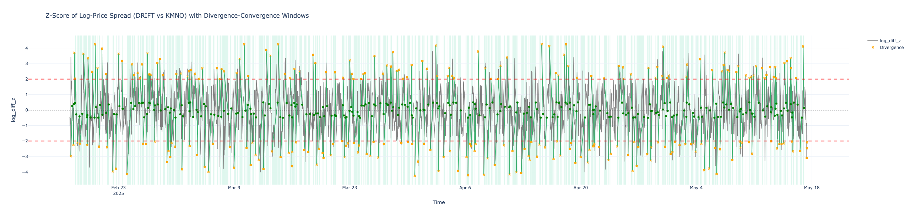
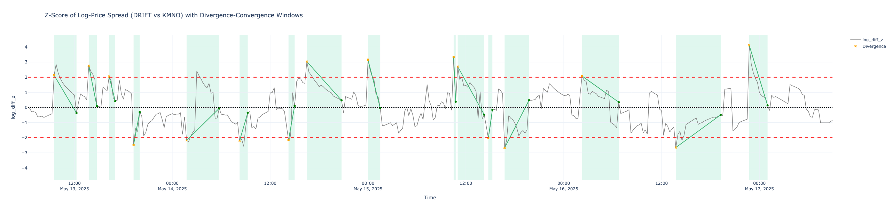

# Validating DRIFT–KMNO Spread Convergence

### Overview

This analysis investigates whether significant short-term divergence in price between DRIFT and KMNO typically reverts (converges) within a fixed time window.

The working assumption:

> When the z-score of the log-price spread exceeds ±2 standard deviations, it often returns to a neutral range within 24 hours.

---

### Dataset

- Source: Drift protocol oracle price data
- Assets: `DRIFT/USD` and `KMNO/USD` perpetuals
- Frequency: 15-minute candles
- Duration: 90 days

---

### Spread Construction

We define the log spread as:

```
log_diff = log(price_drift) - log(price_kmno)
```

This series is then normalized using a rolling z-score:

```
z = (log_diff - mean) / std over a 20-bar window
```

- Window size: 20 bars (\~5 hours)
- Z-scores are recalculated at each timestamp
- This yields `log_diff_z` — a time-series of relative spread deviation

---

### Event Detection Logic

We scan the normalized series to identify **divergence events**, defined as:

- **Entry condition:** `|z| > 2`
- **Look-ahead window:** 96 bars (24 hours)
- **Convergence condition:** within that window, `|z| < 0.5`

To ensure clean statistics, we only track **non-overlapping** events:

- If one divergence leads to convergence, all intermediate divergences are skipped.

For each event, we log:

- `timestamp` (entry time)
- `entry_z` (z-score at entry)
- `direction` (`pos` or `neg`)
- `converged` (True/False)
- `time_to_conv` (in hours, if converged)
- `max_excursion` (maximum absolute z during window)
- `t_conv` and `z_conv` (timestamp and value of convergence point)

---

### Results

**Statistical Summary (based on 279 divergence events):**

```
ADF p-value (log_diff):       0.03999
Total Divergence Events:      279
Convergence Rate:             98.92%
Avg Time to Converge (hrs):   3.53
Worst Excursion (abs z):      4.22
```

---

### Visualization

Below is a visualization of the `log_diff_z` time series with shaded spans showing divergence-convergence windows:

  


This chart also highlights:

- Entry points (divergence triggers)
- Reversion paths (lines)
- Convergence points
